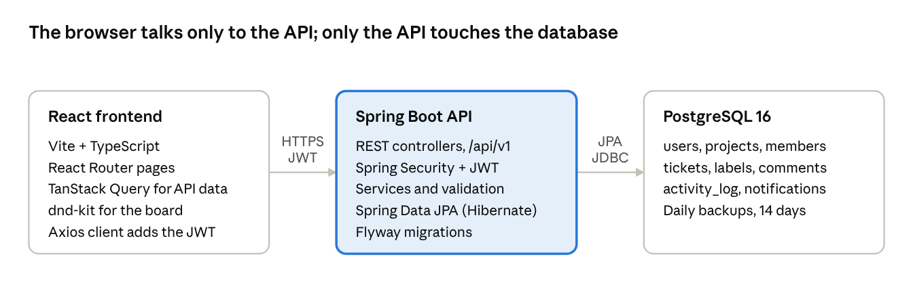

# Issue Tracker — Product Requirements Document

Last updated: 2026-10-05

## Overview

Issue Tracker is a web app where small software teams organise work into projects, track it as tickets, and move tickets across a Kanban board. Tickets have assignees and comment threads, so the full history of a piece of work lives in one place.

**Problem.** Small teams often track work across spreadsheets, chat threads and sticky notes. Status is unclear, ownership is ambiguous, and decisions get lost in chat.

**Goals**

- One source of truth for every piece of work: what it is, who owns it, and where it stands.
- See a project's status at a glance on a Kanban board, and change it by drag and drop.
- Keep discussion attached to the ticket it is about.
- Be simple enough that a new team member is productive within 10 minutes.

**Non-goals (v1)**

- Sprints, story points, burndown charts or time tracking.
- Custom workflows per project (v1 uses a fixed set of statuses).
- Integrations with Git, Slack or email beyond basic notifications.
- Native mobile apps (the web app is responsive instead).

## Users and roles

The app has one system-wide Admin role and three roles per project, so a person can be a Manager on one project and a Member on another.

| Persona | Who they are | What they need |
| --- | --- | --- |
| Project Manager | Leads a team or product area | Create projects, triage tickets, see status at a glance |
| Developer / Team Member | Does the work | See their tickets, update status, discuss details |
| Stakeholder / Viewer | Follows progress | Read-only view of the board and tickets |
| System Admin | Runs the instance | Manage user accounts and access |

**Permissions matrix**

| Action | Admin | Project Manager | Member | Viewer |
| --- | --- | --- | --- | --- |
| Manage user accounts | Yes | No | No | No |
| Create a project | Yes | Yes | No | No |
| Edit or archive a project | Yes | Yes | No | No |
| Add or remove project members | Yes | Yes | No | No |
| View project, board and tickets | Yes | Yes | Yes | Yes |
| Create and edit tickets | Yes | Yes | Yes | No |
| Move tickets on the board | Yes | Yes | Yes | No |
| Assign tickets | Yes | Yes | Yes | No |
| Delete tickets | Yes | Yes | Own only | No |
| Comment on tickets | Yes | Yes | Yes | No |
| Edit or delete a comment | Any | Any | Own only | No |

## Scope

The MVP covers the five named areas (projects, tickets, Kanban board, assignees, comments) plus the login and search needed to use them.

| Area | MVP (v1) | Later (v2+) |
| --- | --- | --- |
| Accounts | Email and password sign-up, login, logout, JWT sessions | SSO (Google, GitHub), password reset by email, 2FA |
| Projects | Create, edit, archive; project key (e.g. `WEB`); member list with roles | Project templates, custom statuses per project |
| Tickets | Create, view, edit, delete; type, priority, status, due date, labels | Sub-tasks, ticket links (blocks / duplicates), attachments |
| Kanban board | Columns per status, drag and drop, ordering within a column | WIP limits, swimlanes, saved board filters |
| Assignees | One assignee and one reporter per ticket; "My tickets" view | Multiple assignees, watchers |
| Comments | Add, edit, delete; Markdown text; @mentions highlighted | Reactions, threaded replies, rich attachments |
| Search and filter | Filter board by assignee, priority, type, label; text search on title | Saved queries, full-text search across comments |
| Activity | Per-ticket activity log (status, assignee, priority changes) | Project-wide activity feed |
| Notifications | In-app notification when assigned or mentioned | Email digests, Slack integration |
| Reporting | Ticket counts by status per project | Burndown, cycle time, sprints |

## Functional requirements

Each area below lists its user stories and the acceptance criteria that define "done". IDs (e.g. `PRJ-1`) are for traceability in tests and pull requests.

### Authentication

- **AUTH-1** As a new user, I can sign up with name, email and password.
  - Email must be unique; password at least 8 characters.
  - Passwords are stored hashed (BCrypt), never in plain text.
- **AUTH-2** As a user, I can log in and stay logged in until I log out or my session expires.
  - Successful login returns an access token (15 min) and a refresh token (7 days).
  - 5 failed attempts in 15 minutes temporarily locks the account for 15 minutes.
- **AUTH-3** As an Admin, I can deactivate a user so they can no longer log in.
  - Deactivated users keep their name on past tickets and comments.

### Projects

- **PRJ-1** As a Project Manager, I can create a project with a name, a unique key (2 to 10 uppercase letters) and a description.
  - The creator becomes the project's Manager automatically.
- **PRJ-2** As a Project Manager, I can add members by email and set their role (Manager, Member, Viewer).
  - A project always has at least one Manager.
- **PRJ-3** As a user, I see a list of projects I belong to, with open ticket counts.
- **PRJ-4** As a Project Manager, I can archive a project.
  - Archived projects are read-only and hidden from the default project list.

### Tickets

- **TKT-1** As a Member, I can create a ticket with title, description, type, priority, assignee, due date and labels.
  - Title is required (max 200 characters); new tickets start in `To Do`.
  - Each ticket gets a readable key from the project key and a counter, e.g. `WEB-42`.
- **TKT-2** As a Member, I can open a ticket detail page showing all fields, comments and activity.
  - The page has a shareable URL: `/projects/WEB/tickets/WEB-42`.
- **TKT-3** As a Member, I can edit any field of a ticket.
  - Every change to status, assignee, priority or due date is written to the activity log.
  - If two people edit the same ticket, the second save is rejected with a "ticket changed" message (optimistic locking).
- **TKT-4** As a Member, I can delete a ticket I reported; Managers can delete any ticket.
  - Delete asks for confirmation and is a soft delete.

### Kanban board

- **BRD-1** As a Member, I see a project's tickets as cards in columns by status: To Do, In Progress, In Review, Done.
  - Cards show key, title, type icon, priority, assignee avatar and due date.
- **BRD-2** As a Member, I can drag a card to another column to change its status, or within a column to reorder it.
  - The change is saved immediately; on failure the card snaps back with an error message.
- **BRD-3** As a Member, I can filter the board by assignee, priority, type and label, and search by title.
  - Filters are reflected in the URL so a filtered board can be shared.
- **BRD-4** As a Member, I can create a ticket directly from a column's "+" button with that status preset.

### Assignees

- **ASN-1** As a Member, I can assign a ticket to any project member, or leave it unassigned.
  - Only members of the project (not Viewers) appear in the assignee picker.
- **ASN-2** As a user, I can open "My tickets" to see all open tickets assigned to me across projects, sorted by due date.
- **ASN-3** As an assignee, I get an in-app notification when a ticket is assigned to me.
- **ASN-4** When a member is removed from a project, their open tickets become unassigned.

### Comments

- **CMT-1** As a Member, I can add a comment to a ticket, written in Markdown.
  - Comments show author, avatar and time, oldest first.
- **CMT-2** As the author, I can edit or delete my comment; edited comments show an "edited" marker.
- **CMT-3** As a Member, I can @mention a project member; they get an in-app notification.

## Domain model

Eight core entities map one-to-one to PostgreSQL tables. A project has many members and tickets; a ticket has one assignee, one reporter, many comments and many activity entries. A supporting `refresh_tokens` table (id, user_id, token_hash (unique, SHA-256), expires_at, revoked_at, created_at) backs login sessions.

| Entity | Key fields | Relationships |
| --- | --- | --- |
| User | id, name, email (unique), password_hash, avatar_url, system_role (ADMIN / USER), active, failed_login_count, failed_login_window_start, locked_until, created_at | Member of many projects; has many refresh tokens |
| Project | id, key (unique), name, description, archived, ticket_counter, created_by, created_at | Has many members, tickets, labels |
| ProjectMember | project_id, user_id, role (MANAGER / MEMBER / VIEWER), joined_at | Join table: User to Project |
| Ticket | id, project_id, number, title, description, type, status, priority, assignee_id, reporter_id, due_date, position, version, deleted, created_at, updated_at | Belongs to a project; has comments, labels, activity |
| Label | id, project_id, name, color | Many-to-many with Ticket via ticket_label |
| Comment | id, ticket_id, author_id, body, edited, created_at, updated_at | Belongs to a ticket and a user |
| ActivityLog | id, ticket_id, actor_id, field, old_value, new_value, created_at | Belongs to a ticket |
| Notification | id, user_id, ticket_id, type (ASSIGNED / MENTIONED), read, created_at | Belongs to a user |

**Enumerations**

| Field | Values |
| --- | --- |
| Ticket type | Bug, Task, Story, Epic |
| Priority | Lowest, Low, Medium, High, Highest (default Medium) |
| Status | To Do, In Progress, In Review, Done |

**Rules**

- `(project_id, number)` is unique; `number` comes from `project.ticket_counter`, incremented in the same transaction.
- `position` orders cards within a status column; moving a card rewrites positions only in the affected column.
- `version` drives optimistic locking (JPA `@Version`).
- Any status can move to any other status in v1; the board is not a strict workflow.

## Key user flows

Four flows cover most daily use; each should take under a minute for a returning user.

**1. Set up a project**

1. Manager signs up or logs in and lands on the Projects page.
2. Clicks "New project", enters name, key and description.
3. Opens Project settings and adds members by email with a role.
4. Lands on the empty board, ready for the first ticket.

**2. Create and assign a ticket**

1. Member clicks "Create ticket" (top bar) or "+" on a board column.
2. Fills title, type, priority, assignee and optional description, due date and labels.
3. Saves; the card appears on the board and the assignee gets a notification.

**3. Work a ticket across the board**

1. Assignee opens "My tickets" or filters the board to themselves.
2. Drags the card from To Do to In Progress; the change is logged.
3. When done, drags it to In Review and @mentions a reviewer in a comment.
4. Reviewer comments or moves it back to In Progress, or moves it to Done.

**4. Discuss a ticket**

1. Member opens the ticket detail page from a card or a shared link.
2. Reads description, comments and activity in one timeline.
3. Adds a comment; mentioned users are notified in-app.

## Non-functional requirements

Targets assume a single deployment serving up to 500 users and 50,000 tickets.

| Area | Requirement |
| --- | --- |
| Performance | API p95 latency under 300 ms; board with 500 cards renders in under 2 s; drag-and-drop feels instant (optimistic UI) |
| Security | HTTPS only; BCrypt password hashing; JWT access tokens; role checks on every endpoint (server side, not just UI); input validation; parameterised queries via JPA; Markdown sanitised before rendering to prevent XSS; CORS limited to the frontend origin |
| Data integrity | Optimistic locking on tickets; soft delete for tickets; database migrations versioned with Flyway |
| Reliability | Daily PostgreSQL backups kept 14 days; health endpoint via Spring Actuator |
| Usability | Responsive from 360 px phones to desktop; keyboard-accessible board actions |
| Accessibility | WCAG 2.1 AA: colour contrast, focus states, ARIA labels on drag-and-drop |
| Browser support | Latest two versions of Chrome, Firefox, Edge and Safari |
| Maintainability | 70% backend test coverage on services; OpenAPI docs generated from code; linting in CI |
| Observability | Structured JSON logs with request IDs; error tracking on frontend and backend |

## Technical architecture

A React single-page app calls a stateless Spring Boot REST API, which is the only component that reads and writes PostgreSQL.

The API keeps no server session (JWT only), so more instances can run behind a load balancer later. All three tiers run locally with Docker Compose.

**Tech stack**

| Layer | Choice | Why |
| --- | --- | --- |
| Frontend | React 18, TypeScript, Vite | Fast dev server, type safety |
| Data fetching | TanStack Query, Axios | Caching, retries, refetch after board moves |
| UI | Tailwind CSS, dnd-kit | Accessible drag and drop with keyboard support |
| Backend | Java 21, Spring Boot 3 (Web, Security, Data JPA, Validation) | Mature, well-documented stack |
| Database | PostgreSQL 16, Flyway | Relational data, versioned schema migrations |
| API docs | springdoc-openapi (Swagger UI) | Docs generated from code |
| Testing | JUnit 5, Mockito, Testcontainers; Vitest, React Testing Library; Playwright | Unit, integration against real Postgres, end-to-end |
| Packaging | Docker, Docker Compose | Same setup on every machine |

**API outline** (base path `/api/v1`, JSON, errors as RFC 7807 problem details, `409 Conflict` on a stale ticket version)

| Method | Path | Purpose |
| --- | --- | --- |
| POST | `/auth/register`, `/auth/login`, `/auth/refresh` | Sign up, log in, refresh token |
| GET | `/users/me`, `/users/me/tickets` | Current user; My tickets |
| GET, POST | `/projects` | List my projects; create a project |
| GET, PUT, DELETE | `/projects/{key}` | Read, update, archive a project |
| GET, POST, PUT, DELETE | `/projects/{key}/members[/{userId}]` | Manage members and roles |
| GET | `/projects/{key}/tickets?status=&assignee=&priority=&type=&label=&q=` | Board and filtered lists |
| POST | `/projects/{key}/tickets` | Create a ticket |
| GET, PATCH, DELETE | `/tickets/{ticketKey}` | Read, edit, soft-delete a ticket |
| PATCH | `/tickets/{ticketKey}/move` | Change status and position (drag and drop) |
| GET, POST | `/tickets/{ticketKey}/comments` | List and add comments |
| PUT, DELETE | `/comments/{id}` | Edit or delete a comment |
| GET | `/tickets/{ticketKey}/activity` | Activity log |
| GET, PATCH | `/notifications`, `/notifications/{id}/read` | List and mark notifications read |

## Success metrics

| Metric | Target |
| --- | --- |
| Time for a new user to create first ticket | Under 10 minutes from sign-up |
| Weekly active users / registered users | 60% or more |
| Tickets moved on the board per active user per week | 5 or more |
| Share of tickets with an assignee | 90% or more |
| Share of tickets with at least one comment | 40% or more |

## Milestones

Build in vertical slices so each milestone ends with something usable end to end.

1. **Foundations**: repo setup, Spring Boot + PostgreSQL + Flyway, React app shell, CI, auth (AUTH-1 to AUTH-3).
2. **Projects**: project CRUD, membership and roles (PRJ-1 to PRJ-4).
3. **Tickets**: ticket CRUD, detail page, activity log (TKT-1 to TKT-4).
4. **Kanban board**: columns, drag and drop, filters (BRD-1 to BRD-4).
5. **Assignees and comments**: assignment, My tickets, comments, mentions, notifications (ASN, CMT).
6. **Hardening**: accessibility pass, performance tests, security review, deployment.

## Risks

| Risk | Mitigation |
| --- | --- |
| Drag-and-drop ordering gets out of sync when two people move cards at once | Server is the source of truth; refetch the column after each move; consider WebSockets in v2 |
| Permission checks missed on some endpoints | Central method-level security (`@PreAuthorize`) plus integration tests per role |
| Scope creep toward sprints and reports | Hold to the non-goals list; log requests for v2 |
| Ticket number collisions under concurrent creates | Increment `ticket_counter` with a row lock in the same transaction |

## Open questions

- [ ] Is this for a single team (one instance) or many organisations (multi-tenant)?
- [ ] Do Members need to edit tickets they did not create, or only Managers and the reporter?
- [ ] Should the board update live for all viewers (WebSockets) in v1, or on refresh?
- [ ] Are file attachments on tickets needed in v1?
- [ ] Where will it be deployed (Docker on a VM, a cloud platform, local only)?
